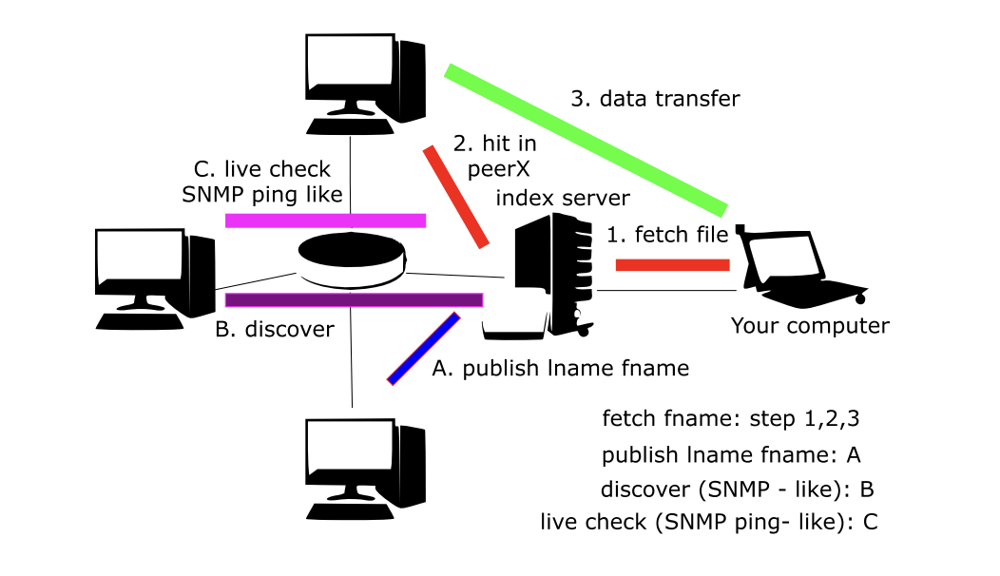

# P2P File Transfer 
## About The Project
This project is about developing a simple Peer-to-Peer file-sharing network application using the TCP/IP protocol stack.

## Project Features

- **Centralized Server:** The server maintains a record of which clients are connected and what files they store.

- **Client File Tracking:** Clients inform the server about the files in their local repository but do not upload the actual file data to the server.

- **File Requests and Sharing:** When a client needs a file not in its repository, it requests the server for help. The server identifies other clients who have the requested file and shares their details. The client then selects a source node and directly fetches the file from the identified client, bypassing the server.

- **Concurrent Downloads:** Multiple clients can download different files from the same client simultaneously, requiring multithreaded client code.

- **Client Command-Shell Interpreter:** The client can execute the following commands:
    - `publish lname fname`: Adds a local file at `lname` to the client's repository as `fname` and notifies the server.
    - `fetch fname`: Retrieves a copy of the target file and adds it to the local repository.

- **Server Command-Shell Interpreter:**
    - `discover hostname`: Lists the files available on the specified host.
    - `ping hostname`: Checks the availability of the specified host.



## Installation and Usage
### Setting up
Clone the repository:
```bash
git clone https://github.com/DangBaoTin/hospital-dbs-main.git
```
To install the needed packages and library, use the command:
```bash
pip install -r requirements.txt
```
If the program cannot run the command `socket.gethostbyname(socket.gethostname())` to get the hostname IP, we have to use the `ipconfig` to get the IP address of your Windows machine (or `ifconfig | grep inet`), then set that value to the `SERVER` and `SERVER_P2P` variables (in both `server.py` and `client.py`).

To run the application, first we need to establish the server first, enter to the terminal:
```bash
python server.py
```
You know you success is when the terminal display the `[STARTING] Server is starting...` and `[LISTENING] Server is listening on {your IP address}`.

Next, for each client, we only have to open another terminal and type in:
```bash
python client.py
```
Note that we can open as many client as we want.

### Hostname register
Choose a hostname to represent themselves on the network. The network doesn’t allow 2 client to have the same hostname. If you choose a hostname that has been taken, you will be required to choose again.

### Ping command
The server can perform live check the client. Type in the terminal:
```bash
ping hostname
```
Server will receive the `Pong !` message indicates that the client is alive. And a return string `The hostname does not exist !` indicates that there’s no hostname with that name currently in the network.

### Commands
- The client will inform the server a filename through the `publish lname fname` command, which `lname` is the filename on the client local machine, `fname` is the filename informed to the server. Then the server can use the discover command to inspect the file list of that client.

- To fetch a specific file, the client will use the `fetch fname` command, which `fname` is the requested filename.

- To disconnect from the server, the client will use the `disconnect` command. On the server side, if the number of client on the network is 0, the server will automatically shut down.